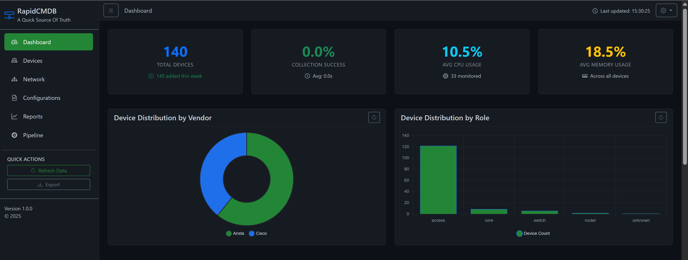

# RapidCMDB: Network Asset Discovery & CMDB Reconciliation

[](https://python.org)
[](LICENSE)
[](https://napalm.readthedocs.io)
[](https://flask.palletsprojects.com)


## ✨ Transform Network Auditing

**Transform weeks of manual network auditing into hours of automated intelligence.**

**Before RapidCMDB**: 📋 Manual spreadsheets, incomplete inventories, outdated topology maps  
**After RapidCMDB**: 🎯 Automated discovery, real-time monitoring, accurate CMDB

RapidCMDB is a **Proof of Concept (POC)** demonstrating an innovative approach to rapidly gain deep insight into network environments that may lack an accurate Configuration Management Database (CMDB) through automated discovery and data collection. While currently designed for **single-user deployment** as an early release, it offers highly useful capabilities for efficient network asset management and reconciliation.

### Key Results
- **65k+ hosts scanned** in minutes with `/16` network support
- **Enterprise SNMPv3** with SHA256/AES256 encryption support
- **Multi-vendor support** (Cisco, Aruba, Palo Alto, Fortinet, Juniper, Dell, HP, and more)
- **Real-time topology** with LLDP-based mapping and bidirectional consistency
- **Zero-touch** NAPALM compatibility analysis for automation planning
- **Concurrent processing** with intelligent rate limiting and timeout scaling

---

## 🚀 Quick Start

### Prerequisites
- Python 3.10+
- Git
- Network access to target devices

### Installation
```bash
git clone https://github.com/scottpeterman/rapidcmdb.git
cd rapidcmdb
python -m venv .venv
source .venv/bin/activate  # On Windows: .venv\Scripts\activate
pip install -r requirements.txt
```

### 5-Minute Demo
1. **Start the web interface**: 
   ```bash
   python app.py
   ```
2. **Access dashboard**: http://localhost:5000
3. **Run a scan**: Navigate to Pipeline → Network Scanner → Enter `192.168.1.0/24`
4. **View results**: Check Devices tab for discovered inventory

### CLI Alternative (Advanced Users)
```bash
# Quick network scan (basic)
./gosnmpcli.exe -mode scan -target 192.168.1.0/24

# Fast scan of large network (65k+ hosts)
./gosnmpcli.exe -mode scan -target 172.16.0.0/16 -fast -concurrency 100

# SNMPv3 enterprise scanning
./gosnmpcli.exe -mode scan -target 192.168.100.0/24 \
  -snmp-version 3 -username "netadmin" \
  -auth-protocol SHA256 -auth-key "SecureAuthPass123" \
  -priv-protocol AES256 -priv-key "SecurePrivPass456"

# Export to CSV with persistence
./gosnmpcli.exe -mode scan -target 10.0.0.0/24 \
  -output csv -output-file network-inventory.csv \
  -enable-db -database devices.json

# Import scan results into CMDB
python db_scan_import.py --file scans/scanner_output.json

# Collect detailed device data
python npcollector1.py --database napalm_cmdb.db

# Import collected data
python db_manager.py --import-dir captures
```

### Project Structure
```
rapidcmdb/
├── app.py                 # Main Flask application
├── blueprints/           # Modular Flask blueprints
│   ├── dashboard.py      # Main dashboard
│   ├── devices.py        # Device inventory
│   ├── pipeline.py       # Data collection pipeline
│   ├── topology.py       # Network topology
│   └── reports.py        # Analysis reports
├── gosnmpcli.exe         # High-speed network scanner
├── db_manager.py         # Database operations
├── npcollector1.py       # NAPALM data collector
├── config/               # Configuration files
│   └── vendor_fingerprints.yaml
├── templates/            # Web UI templates
├── captures/             # Collected device data
└── scans/               # Scanner output files
```

---

## 📸 Screenshots

### Dashboard Overview
  
*Real-time network health metrics and device distribution*

### Device Inventory
  
*Comprehensive device listing with filtering and search*

### Network Scanning
  
*High-speed network discovery with real-time progress*

### Data Collection
  
*NAPALM-based detailed device data gathering*

### Analytics & Reports
  
*Advanced device fingerprinting and compatibility analysis*

---

## 🔄 How It Works

### 1. **Discover** 🔍
Ultra-fast network scanning with `gosnmptk` - scan entire `/16` networks (65k+ hosts) in minutes using intelligent SNMP fingerprinting and concurrent processing.

### 2. **Collect** 📊  
NAPALM-based data collection gathers comprehensive device information including configs, interfaces, and topology.

### 3. **Analyze** 🧠
Advanced pattern matching and vendor detection provides actionable intelligence about your network.

### 4. **Visualize** 📈
Interactive web dashboard with real-time topology maps, device health, and export capabilities.

---

## 🌟 Key Features

### 🎮 Interactive Dashboard
- **Real-time Monitoring**: Live device health metrics, CPU/memory usage tracking
- **Network Topology**: Interactive LLDP-based mapping with multiple export formats
- **Pipeline Management**: WebSocket-powered real-time progress tracking
- **Multi-format Export**: Mermaid diagrams, JSON, Draw.io XML for professional documentation

### 🔍 Ultra-Fast Network Discovery
- **Enterprise-Scale Performance**: Scan `/16` networks (65k+ hosts) in minutes
- **Intelligent Concurrency**: Dynamic timeout scaling based on network size
- **YAML-Driven Fingerprinting**: Extensible vendor detection without code changes
- **Full SNMP Support**: SNMPv2c and SNMPv3 with all crypto protocols (SHA256, AES256)
- **Multiple Output Formats**: JSON, CSV, table formats with persistence options
- **Network Intelligence**: Automatic performance tuning and rate limiting

### 📊 Comprehensive Data Collection
- **NAPALM Integration**: Full support for ios, eos, panos, procurve, arubaoss, fortios, junos, nxos, asa drivers
- **Rich Operational Data**: Facts, configurations, inventory, interfaces, LLDP neighbors, ARP/MAC tables
- **Hardware Monitoring**: Environment data including CPU, memory, temperature, power supplies, fans
- **Optical Metrics**: Detailed transceiver information with input/output power and laser bias
- **Change Tracking**: Configuration diff detection with SHA256 hashing

### 🔄 Advanced Analytics
- **Vendor Intelligence**: Sophisticated pattern matching with configurable fingerprints
- **NAPALM Compatibility**: Automated assessment for network automation readiness
- **Confidence Scoring**: Data quality assessment with detailed metrics
- **Topology Consistency**: Bidirectional LLDP validation and normalization

---

## 🎯 Perfect For

- **Network Engineers**: Rapid network audits, documentation, and topology discovery
- **Security Teams**: Asset discovery, inventory validation, and vulnerability assessment preparation
- **IT Managers**: Network compliance reporting and infrastructure documentation
- **Consultants**: Quick client network assessment and professional documentation
- **DevOps Teams**: Network automation planning and NAPALM compatibility testing
- **Infrastructure Teams**: CMDB reconciliation and change management

---

## 🏗️ Technical Architecture

RapidCMDB implements a sophisticated, multi-stage data ingestion pipeline designed for enterprise-grade network asset management:

### Stage 1: High-Speed Network Discovery (`gosnmptk` scanner)

The discovery engine utilizes an optimized Go-based SNMP toolkit for enterprise-scale, low-impact network scanning:

- **Enterprise Performance**: Capable of scanning `/16` networks (65k+ hosts) in minutes
- **Intelligent Scanning Strategy**: Initial TCP port scans on standard network device ports, followed by detailed SNMP fingerprinting only on responsive hosts
- **Dynamic Performance Tuning**: Automatic timeout scaling based on network size and device response times
- **Concurrent Processing**: Configurable concurrency (up to 200+ operations) with intelligent rate limiting
- **Extensible Fingerprinting Engine**: Driven by configurable `vendor_fingerprints.yaml` with:
  - **Vendor-Specific Profiles**: Detailed detection patterns for 20+ major vendors
  - **Prioritized OID Queries**: Optimized OID selection for model, version, and serial extraction
  - **Exclusion Patterns**: Prevents misclassification between similar vendors
  - **Configurable Timeouts**: Tunable performance parameters for different network conditions

**Output**: Structured JSON files with comprehensive device metadata

### Stage 2: Data Import & Deduplication (`db_scan_import.py`)

Processes raw discovery data into the core SQLite CMDB with intelligent normalization:

- **Device Key Generation**: SHA256 hashing of vendor|serial|model for stable identification
- **Enhanced Data Extraction**: Smart serial number and model parsing from system descriptions
- **Automated Classification**: Site code extraction and device role assignment
- **Deduplication Logic**: Prevents duplicate entries while updating existing records
- **Filtering Capabilities**: Vendor, device type, site, and confidence-based filtering

### Stage 3: Detailed Collection (`npcollector1.py`)

Concurrent NAPALM-based data collection for comprehensive device intelligence:

- **Dynamic Driver Selection**: Intelligent NAPALM driver mapping based on device characteristics
- **Comprehensive Data Retrieval**: 
  - Device facts (hostname, OS, uptime, hardware details)
  - Full configurations (running, startup, candidate)
  - Network data (interfaces, LLDP, ARP, MAC tables, routing)
  - Hardware inventory with detailed component information
  - Environmental monitoring (CPU, memory, temperature, power)
  - Optical transceiver metrics and user account information
- **Concurrent Processing**: ThreadPoolExecutor for efficient multi-device collection
- **Local Archive**: Structured storage in `captures/` directory for raw data preservation

### Stage 4: Database Integration (`db_manager.py`)

Imports detailed collection data into the comprehensive CMDB schema:

- **Robust Schema**: 12+ tables covering devices, interfaces, topology, environment, configurations
- **Audit Trail**: Complete collection run tracking with success/failure metrics
- **Change Detection**: Automatic configuration hash comparison for change tracking
- **Trigger Automation**: Database triggers for topology auto-population
- **CLI Operations**: Command-line utilities for database management and reporting

### Database Schema Highlights

**Core Tables**:
- `devices` - Primary device inventory with vendor, model, serial, role
- `interfaces` - Physical and logical interface details with IP assignments
- `lldp_neighbors` - Network topology data with interface normalization
- `collection_runs` - Audit trail with detailed success/failure tracking
- `device_configs` - Configuration storage with change detection
- `environment_data` - Hardware health metrics and environmental monitoring

**Advanced Features**:
- **Data Integrity**: SQL constraints for VLAN ranges, MAC formats, CPU usage validation
- **Temporal Tracking**: Automatic timestamp management with triggers
- **JSON Storage**: Flexible vendor-specific data accommodation
- **Optimized Indexing**: Strategic indexes for device lookups and time-series queries

---

## 🎮 Interactive Web Dashboard

The Flask-based web application provides comprehensive network management through modular blueprints:

### Core Interface Components

**Dashboard (`dashboard.py`)**:
- Network overview with device counts and health metrics
- Vendor and role distribution visualizations
- Real-time statistics: collection success rates, average CPU/memory usage
- Quick navigation to all major sections

**Device Management (`devices.py`)**:
- Comprehensive device inventory with advanced filtering
- CTE-based queries preventing data duplication
- Smart status determination (online/error/stale/unknown)
- CSV export capabilities and detailed device views

**Pipeline Management (`pipeline.py`)**:
- Real-time WebSocket communication for live progress updates
- Multi-stage process orchestration (Scanner → Collector → Import)
- Intelligent file discovery with robust error handling
- Process lifecycle management with cleanup

**Network Topology (`topology.py`)**:
- LLDP-based topology mapping with interface normalization
- Bidirectional consistency enforcement
- Multiple export formats (Mermaid, JSON, Draw.io XML)
- Advanced filtering by site, role, and device patterns

**Analytics & Reports (`reports.py`)**:
- Advanced device fingerprinting with confidence scoring
- NAPALM compatibility analysis for automation planning
- Vendor/device type normalization with pattern matching
- Detailed scan analysis with actionable insights

### Real-time Features
- **WebSocket Integration**: Live progress tracking across all pipeline stages
- **Process Monitoring**: Real-time output streaming and error reporting
- **Statistics Updates**: Dynamic metrics and completion tracking
- **Interactive Feedback**: User-friendly progress indicators and status updates

---

## 🔧 Performance & Scalability

### Optimization Features
- **Strategic Database Indexing**: Optimized for device lookups, IP searches, and time-series queries
- **Efficient Storage**: JSON compression for large data structures
- **Batch Operations**: Bulk import/update capabilities for collected data
- **Concurrent Processing**: Multi-threaded collection with configurable worker pools

### Scalability Characteristics
- **Memory Efficient**: SQLite-based storage with optimized queries
- **Network Friendly**: Low-impact scanning with configurable timeouts
- **Resource Adaptive**: Performance scales with available system resources
- **Extensible Architecture**: Modular design supporting custom integrations

---

### Reliability Features
- **Comprehensive Error Handling**: Graceful recovery from partial failures
- **Data Validation**: Input validation and SQL constraints
- **Process Cleanup**: Proper resource management and cleanup
- **Detailed Logging**: Extensive logging for troubleshooting

---

## ❓ Frequently Asked Questions

**Q: Is this production-ready?**
A: RapidCMDB is currently a Proof of Concept designed for single-user deployment. It's excellent for network audits, assessments, and CMDB reconciliation projects.

**Q: What vendors are supported?**
A: Extensive support including Cisco, Aruba, Palo Alto, Fortinet, Juniper, Dell, HP, and 15+ others via the configurable fingerprinting engine in `vendor_fingerprints.yaml`.

**Q: Can I use this from the command line?**
A: Yes! The web UI is a front-end to powerful CLI tools:
- `gosnmpcli.exe` for network scanning
- `npcollector1.py` for NAPALM data collection  
- `db_manager.py` for database operations
- `db_scan_import.py` for importing scan results

**Q: What's the typical workflow?**
A: 1) Scan network → 2) Import devices → 3) Collect detailed data → 4) Analyze in web UI. The Pipeline tab automates this entire process.

**Q: What about security and SNMPv3?**
A: Full enterprise security support including:
- SNMPv3 with authentication (SHA, SHA256) and privacy (AES, AES256)
- Multiple community string testing for SNMPv2c
- Configurable timeout and retry settings
- Database persistence with device deduplication

**Q: How fast is the network scanning?**
A: The `gosnmptk` scanner can handle enterprise-scale networks efficiently:
- Small networks (`/24`): Seconds to complete
- Medium networks (`/20`, `/21`): Minutes to complete  
- Large networks (`/16`): Can scan 65k+ hosts in minutes with `-fast` mode
- Supports configurable concurrency (up to 200+ concurrent operations)

---

## 🚀 Roadmap

- [ ] **Multi-user Support**: Authentication and role-based access control
- [ ] **REST API Expansion**: Comprehensive API for external integrations
- [ ] **Additional Vendor Support**: Expanded fingerprinting for emerging vendors
- [ ] **Advanced Analytics**: Machine learning for network insights
- [ ] **Integration Modules**: ServiceNow, Jira, and other ITSM connections
- [ ] **Search**: Advanced search of content - Configs, MAC, ARP etc

---

### Development
- **Vendor Fingerprints**: Add new vendor patterns to `vendor_fingerprints.yaml`
- **NAPALM Extensions**: Expand driver support and data collection methods
- **Web Interface**: Enhance Flask blueprints and user experience
- **Export Formats**: Add new topology export formats

See our [Contributing Guide](CONTRIBUTING.md) for development setup and guidelines.

---

## 🌟 Star This Project

If RapidCMDB helps with your network management, please ⭐ **star this repository**!

**Questions?** Open an [issue](https://github.com/scottpeterman/rapidcmdb/issues) or start a [discussion](https://github.com/scottpeterman/rapidcmdb/discussions)

---

## 📚 Source Repositories

* **RapidCMDB**: [https://github.com/scottpeterman/rapidcmdb](https://github.com/scottpeterman/rapidcmdb)
* **GoSNMPtk (Scanner)**: [https://github.com/scottpeterman/gosnmptk](https://github.com/scottpeterman/gosnmptk)